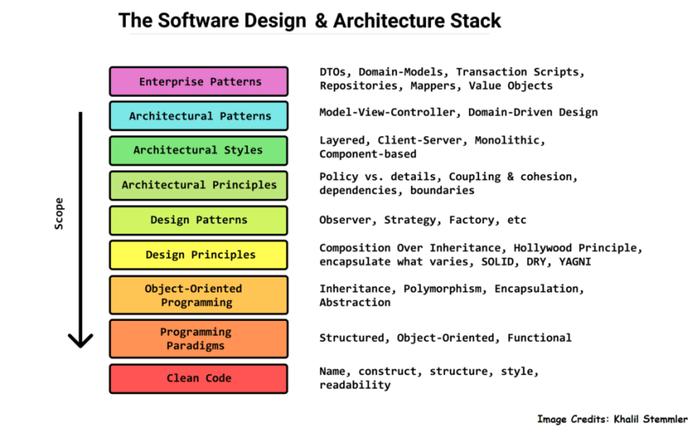
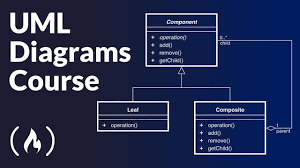

# Title Design Pattern in PHP
## Also known as
* name 1
* name 2
## Intent
**Title** is a design pattern

## Diagram

## Critical Point
It makes ...

## Where to Use
### Problem

## Where **not** to Use

## Citations
