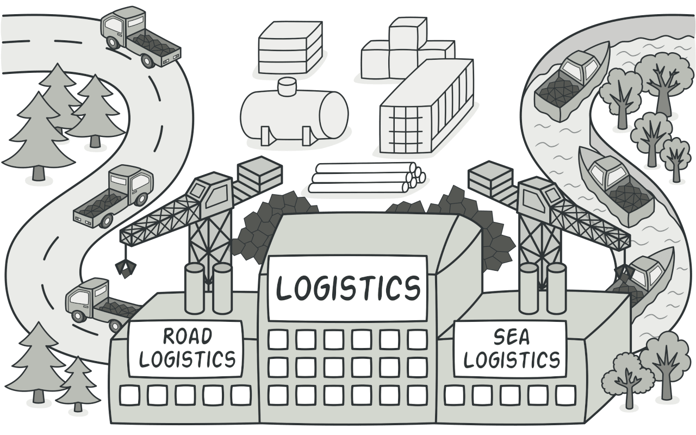

# Factory Method Design Pattern in PHP
## Also known as
* Virtual Constructor
## Intent
**Factory Method** provides an interface for creating objects in a superclass, but allows subclasses to alter the type of objects that will be created.

## Diagram

## Critical Point
It makes a method, that client has not aware of, but uses with no issue.
## Where to Use
### Problem

## Where **not** to Use

## Citations
* [refactoring.guru](https://refactoring.guru/design-patterns/factory-method)