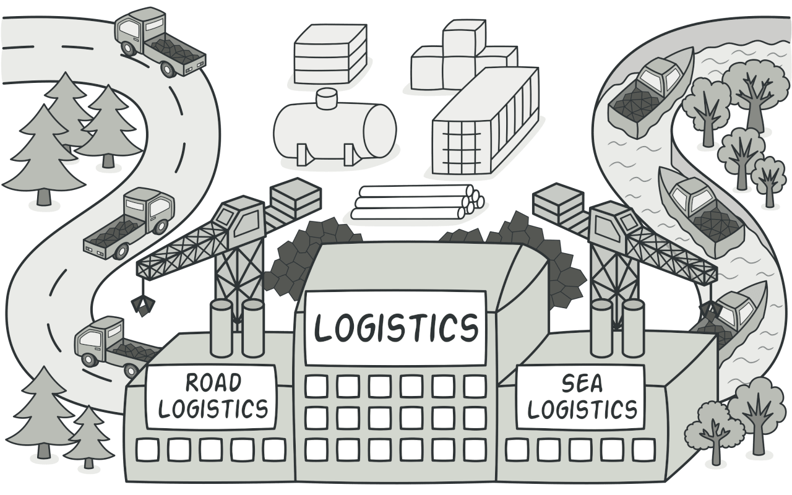

# Factory Model Design Pattern in PHP
## Also known as
* Virtual Constructor
## Intent
**Factory Model** provides an interface for creating objects in a superclass, but allows subclasses to alter the type of objects that will be created.

